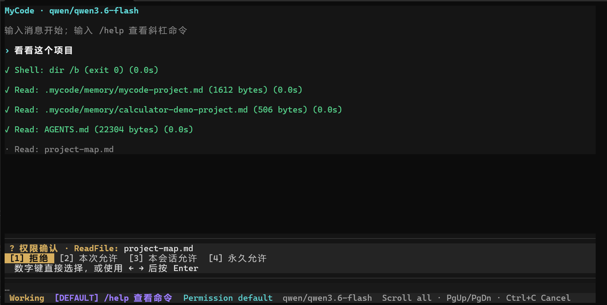
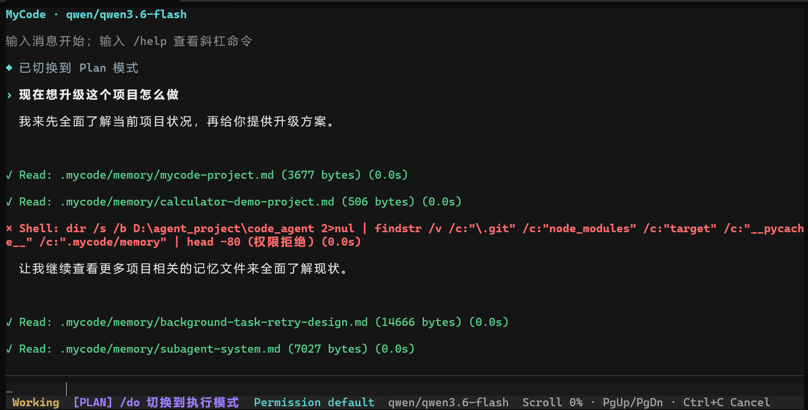
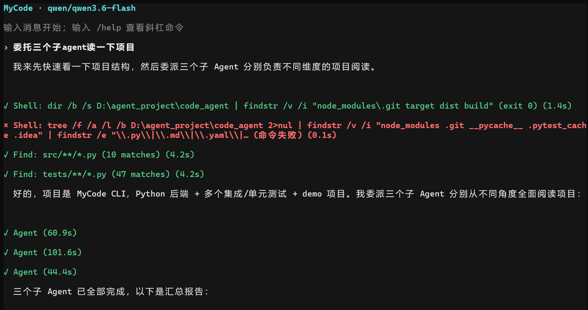

<h1 align="center">MyCode Agent Runtime</h1>

<p align="center">
  <strong>面向终端的 Coding Agent 运行时</strong><br>
  把模型推理、工具执行、上下文管理、安全决策与多 Agent 协作组装成一条可持续运行的工程链路。
</p>

<p align="center">
  
  
  
  
  
</p>

<p align="center">
  <a href="#界面展示">界面展示</a> ·
  <a href="#运行演示">运行演示</a> ·
  <a href="#核心能力">核心能力</a> ·
  <a href="#快速开始">快速开始</a> ·
  <a href="#安全边界">安全边界</a>
</p>

MyCode 不是一次性生成代码的 Prompt 包装器。它让模型在同一项任务中持续读取项目、调用工具、修改文件、运行测试并根据结果决定下一步；运行时负责协议适配、权限控制、上下文压缩、会话持久化和协作调度。

这套项目适合两类读者：想直接使用终端 Coding Agent 的开发者，以及希望研究 Agent Loop、Tool Calling、MCP 和多 Agent Runtime 如何落到工程实现的人。

## 核心能力

| 能力 | 工程实现 |
|---|---|
| **ReAct Agent Loop** | 在一次用户请求内循环执行“模型决策 → 工具调用 → 结果回填”，直到完成任务、达到预算或遇到明确错误 |
| **双协议 Provider** | 统一适配 Anthropic Messages 与 OpenAI Chat Completions，屏蔽请求结构、SSE 事件和 Tool Calling 差异 |
| **23 个内置工具** | 覆盖工作区操作、Skill、子 Agent、后台任务和 Agent Team；只读工具可并发，写工具形成顺序屏障 |
| **MCP 懒加载** | 启动时发现并注册工具，仅在 `tool_search` 命中后向下一次模型请求注入完整 JSON Schema |
| **上下文生命周期** | 大工具结果落盘为 artifact，长对话结构化压缩，会话与长期记忆按项目保存并按需恢复 |
| **五层安全机制** | Plan 只读约束、危险命令拦截、路径隔离、分层权限规则、运行模式与人工确认逐层生效 |
| **多 Agent 双模式** | 委派式子 Agent 处理一次性独立任务；Agent Team 通过任务板、JSONL 邮箱和 Git Worktree 完成长流程协作 |

## 界面展示

### 权限确认

工具执行触及受控资源时，终端会暂停当前调用并展示具体操作，用户可以选择拒绝、仅本次允许、本会话允许或永久允许。



### Plan 模式

Plan 模式允许 Agent 读取项目并形成升级方案，同时拦截写操作和超出权限边界的命令；确认方案后可用 `/do` 切换回执行模式。



### 多子 Agent 委派

主 Agent 可以把不同维度的项目阅读任务委派给多个子 Agent，并在全部任务结束后汇总结果。



## 运行演示

下面是一轮真实的 Agent Team 端到端演示：Lead 将两个独立缺陷分派给不同成员，成员在隔离的 Git Worktree 中并行开发并分别提交；Lead 顺序集成提交、执行模块测试，最终完成全量回归。

```text
初始状态        2 failed, 6 passed
并行开发        2 个成员 · 2 个独立 Worktree · 2 个提交
顺序集成        2 次 merge · 每次合并后执行聚焦测试
最终验证        8 passed
```

这个流程展示的不是“同时调用两个模型”，而是任务拆分、所有权隔离、进度通信、提交归属、集成顺序和最终验收组成的完整协作闭环。

## 运行架构

```text
用户输入
  → CLI / 会话 / 斜杠命令
  → ReAct Agent Loop
      ├─ Provider：Anthropic / OpenAI
      ├─ Tools：Builtin / Skill / MCP
      ├─ Context：artifact / compaction / memory
      ├─ Safety：permission / hook / path boundary
      └─ Agents：subagent / background task / team / worktree
  → 结构化事件流
  → 终端输出
```

各层通过统一消息和事件模型连接。Provider 不操作终端，工具不感知模型协议，UI 也不直接处理远端响应；因此切换模型协议、扩展 MCP 工具或创建子 Agent 时，可以复用同一条执行链。

## 关键设计

### 1. ReAct Loop：让任务连续推进

普通输入会启动一轮 Agent Loop。模型可以先搜索代码，再读取目标文件、修改实现、运行测试，并根据新结果继续行动。运行时限制最大模型请求次数，并把取消、超时、上下文溢出和工具错误作为明确状态返回，不会把中途停止包装成成功。

### 2. Provider：协议差异停在边界层

OpenAI 与 Anthropic 使用不同的消息结构、工具定义、思考内容和流式事件格式。Provider 层负责完成双向转换，上层只处理统一的消息、工具调用和 Usage 数据。Agent Loop、上下文管理和终端 UI 不需要为不同厂商维护两套流程。

### 3. 工具系统：统一注册、校验与调度

23 个内置工具按职责组成：

| 分组 | 数量 | 内容 |
|---|---:|---|
| 工作区与工具发现 | 7 | 文件读写、精确编辑、命令执行、文件查找、代码搜索、MCP 工具搜索 |
| Skill | 1 | 按需加载 Skill 指令及其工具范围 |
| Agent 委派 | 1 | 创建定义式子 Agent 或匿名 Fork |
| 后台任务 | 3 | 列出、查询和停止后台 Agent 任务 |
| Agent Team | 11 | 团队生命周期、共享任务、成员控制和 JSONL 邮箱通信 |

所有工具使用 JSON Schema 描述参数，并在本地执行前再次校验。连续只读调用可以并发；写调用逐个执行，并隔开前后的读取批次。命令执行固定按写操作调度，不根据 Shell 文本猜测副作用。

### 4. MCP：完整注册，按需暴露

MyCode 支持 stdio 与 Streamable HTTP MCP Server。应用启动时并行完成连接、发现和注册，但未激活工具只向模型提示名称，不立即携带全部描述和参数 Schema。

模型通过 `tool_search` 按名称或用途搜索；命中工具从下一次请求开始按标准 Tool Calling 协议可见。激活后仍然经过原有的参数校验、权限、调度、超时和结果处理链。

### 5. 上下文：正文可追溯，历史可压缩

- 单个或同批工具结果过长时，完整正文写入当前会话的 artifact，模型只接收摘要预览和可继续读取的路径。
- 请求接近上下文窗口时，较早消息被结构化摘要替代，最近消息组保持完整；摘要失败会停止压缩，不会静默丢弃历史。
- 会话使用 JSONL 按项目保存；用户偏好、纠正和项目知识进入长期记忆，通过轻量索引按需加载。

### 6. Multi-Agent：委派与协作分开建模

| 模式 | 适用场景 | 运行方式 |
|---|---|---|
| **委派式子 Agent** | 调研、代码探索、一次性独立实现 | 前台等待结果，或移交后台后通过 Task 工具查询 |
| **Agent Team** | 多模块开发、任务依赖、持续沟通与分支集成 | Lead 管理共享任务板，成员原子认领任务，在独立 Worktree 中开发并通过邮箱通信 |

Team 模式要求工作区是 Git 仓库。Lead 负责拆分、协调、集成和验证，成员负责各自任务与提交，避免多个 Agent 同时修改同一工作区。

## 快速开始

### 环境要求

- Python 3.11+
- Windows、macOS 或 Linux 的现代终端
- 一个兼容 Anthropic Messages 或 OpenAI Chat Completions 的模型服务

### 安装

```bash
python -m pip install -e .
```

需要运行测试时安装开发依赖：

```bash
python -m pip install -e ".[dev]"
```

### 配置

复制公开示例文件：

```powershell
# PowerShell
Copy-Item .env.example .env
Copy-Item config.example.yaml config.local.yaml
```

```bash
# bash / zsh
cp .env.example .env
cp config.example.yaml config.local.yaml
```

最小 OpenAI 兼容配置：

```yaml
active: openai-main

providers:
  - name: openai-main
    protocol: openai
    model: your-model-id
    base_url: https://api.example.com/v1/chat/completions
    api_key: ${OPENAI_API_KEY}
    thinking: false
```

密钥放在操作系统环境变量或本地 `.env` 中，不要写入准备提交的 YAML。Anthropic、MCP、Agent、Worktree 与生命周期 Hook 的完整示例见 [`config.example.yaml`](config.example.yaml)。

### 启动

```bash
mycode
```

也可以直接运行模块：

```bash
python -m mycode
```

## 常用命令

| 命令 | 用途 |
|---|---|
| `/help` | 查看命令和详细用法 |
| `/plan [任务]` | 进入持续 Plan 模式，只允许读取和规划 |
| `/do` | 返回执行模式 |
| `/compact [保留重点]` | 主动压缩较早对话 |
| `/session list` | 查看当前项目的本地会话 |
| `/session resume <ID>` | 恢复历史会话及其有效工作区绑定 |
| `/memory list` | 查看本地长期记忆 |
| `/permission` | 查看或切换权限模式 |
| `/status` | 查看模式、会话、消息和 Token 估算 |
| `/review [关注点]` | 审查当前 Git 工作区变更 |
| `/worktree list` | 查看 MyCode 管理的 Worktree |
| `/exit` | 保存状态并退出 |

输入普通文本会进入 Agent Loop；以 `/` 开头的输入优先交给本地命令系统。生成期间按 `Ctrl+C` 只取消当前轮，不会直接退出程序。

## 安全边界

工具执行前依次经过：

```text
Plan 只读约束
  → 危险命令黑名单
  → 工作区路径隔离
  → 用户级 / 项目级 / 本地 / 会话权限规则
  → strict / default / allow 模式与人工确认
```

文件工具会解析真实路径并拒绝绝对路径、`..` 和符号链接逃逸。权限规则支持精确匹配与 glob；越接近当前项目的规则优先级越高，同级冲突时拒绝优先。

> **重要：** `execute_command` 的工作目录固定在项目中，但它不是操作系统级沙箱。获准执行的 Shell 命令仍可能访问工作区之外的资源。处理不可信项目时，应结合最小权限、容器或独立受控环境。

## 项目结构

```text
src/mycode/
├── app/           # 终端 UI、输入循环和事件展示
├── agent/         # ReAct Loop、运行时提示和取消控制
├── providers/     # Anthropic / OpenAI 协议与 SSE 适配
├── tools/         # 工具注册、参数校验、执行和调度
├── mcp/           # MCP 连接、发现、适配和懒加载
├── context/       # Token 估算、artifact 和历史压缩
├── memory/        # 长期记忆提取、索引和加载
├── skills/        # Skill 发现、信任与运行时
├── agents/        # 子 Agent、后台任务和通知
├── teams/         # Agent Team、任务板和邮箱
├── worktrees/     # Git Worktree 创建、绑定和清理
├── permissions/   # 分层规则、权限模式和审批
├── hooks/         # 生命周期事件、条件与动作
├── commands/      # 斜杠命令、补全和分发
├── persistence/   # 会话与运行状态持久化
├── settings/      # YAML、.env 与环境变量配置
└── models/        # 跨模块消息、事件和配置模型
```

## 编译检查

```bash
python -m compileall -q src
```

## License

本项目基于 [MIT License](LICENSE) 发布。
